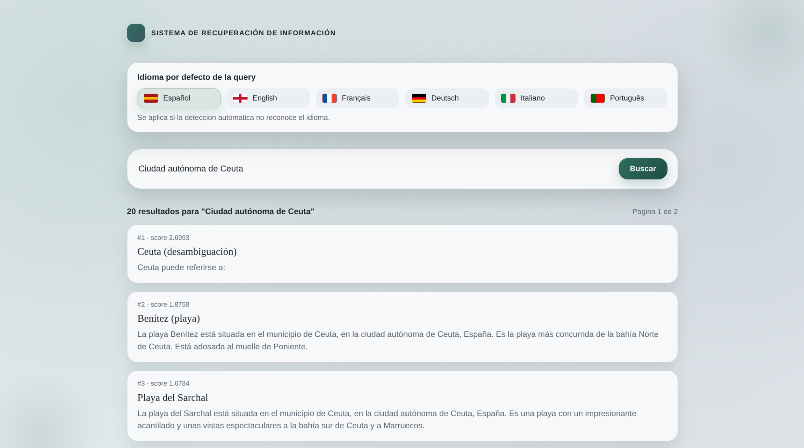
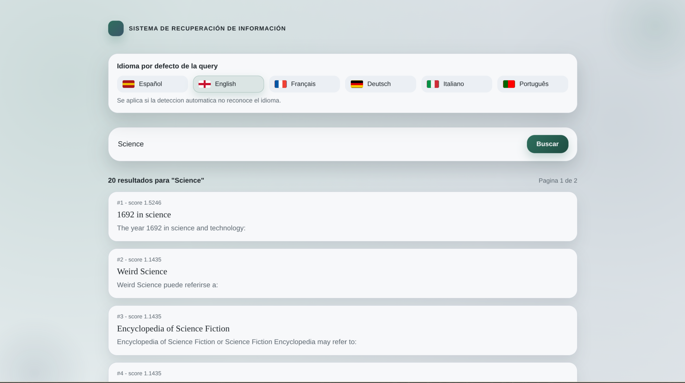

# Sistema de Recuperacion de Informacion (RI)

Proyecto completo de un sistema de recuperacion de informacion con indexacion SPIMI y busqueda TF-IDF. El backend ofrece los endpoints de indexacion y consulta; el frontend permite lanzar queries, seleccionar idioma por defecto y explorar resultados con paginacion.

Este README integra y resume la informacion clave de `backend/README.md` y `frontend/README.md`, y funciona como memoria de la practica.

---

## Objetivo y alcance

- Construir un pipeline completo: preprocesado, indexacion y busqueda.
- Soportar multiples idiomas con deteccion automatica y fallback configurable.
- Exponer una API clara para indexar y consultar un corpus JSONL.
- Proveer una UI para explorar resultados.

---

## Capturas

Busqueda "Ceuta":



Busqueda "Science":



---

## Arquitectura general

- Backend (FastAPI + servicios de RI)
  - Preprocesado por idioma (stopwords + stemming).
  - Indexacion por bloques (SPIMI) con escritura en disco.
  - Busqueda TF-IDF leyendo postings por offset y metadatos en SQLite.
- Frontend (React + Vite)
  - Formulario de busqueda y selector de idioma.
  - Resultados con titulo, snippet y enlace al documento.
  - Paginacion local cuando `TOP_K` devuelve mas de 10 resultados.

Flujo simplificado:

1) Usuario lanza query en el frontend.
2) Frontend llama a `GET /search` (con `default_language`).
3) Backend preprocesa la query, busca en el indice y devuelve resultados.
4) Frontend renderiza lista y pagina si aplica.

---

## Estructura del repositorio

```
.
├── backend/
├── data/
├── docs/
├── frontend/
└── README.md
```

Resumen de carpetas:
- `backend/`: API, indexacion y busqueda.
- `frontend/`: interfaz React + Vite.
- `data/`: corpus e indices.
- `docs/`: documentacion y capturas.

---

## Datos e índices

Estructura esperada en `data/`:

```
data/
├── raw/
│   └── corpus.jsonl         # Corpus de entrada por defecto
└── indexes/
    ├── index.meta.json      # Metadatos del índice (formato block)
    ├── index.postings       # Postings por término (archivo de texto binario)
    ├── index.terms.json     # Diccionario term -> [offset, length]
    ├── doc_store.jsonl      # Metadatos por documento (una línea por doc)
    └── doc_store.sqlite     # doc_uid -> offset en doc_store.jsonl
```

Durante la indexacion se generan temporalmente:
- `data/indexes/blocks/`
- `data/indexes/doc_store_parts/`

Si `INDEX_KEEP_BLOCKS=false` estos directorios se eliminan al finalizar.

---

## Backend

### Tecnologias

- Python 3.11+
- FastAPI + Uvicorn
- NLTK (stopwords, SnowballStemmer)
- Lingua Language Detector (offline)
- Pydantic + pydantic-settings
- SQLite (indice de offsets del doc_store)

### Estructura interna

```
backend/
├── app/
│   ├── api/           # endpoints
│   ├── core/          # config
│   ├── schemas/       # request/response
│   ├── services/      # preprocess, indexer, searcher
│   └── storage/       # paths
├── scripts/
└── requirements.txt
```

### Pipeline de indexacion (SPIMI)

*SPIMI (Single-Pass In-Memory Indexing)* es una técnica para construir un índice invertido leyendo el corpus una sola vez y procesándolo por bloques que caben en memoria. Cada bloque genera su propio índice parcial (postings), se escribe a disco y al final se fusionan todos los bloques para crear el índice global. Así se evita cargar todo el corpus en RAM y se puede escalar a colecciones grandes.

1) Seleccion de corpus JSONL (`data/raw/corpus.jsonl` por defecto).
2) Particionado por offsets para evitar cargar todo en memoria.
3) Procesado en paralelo con `ProcessPoolExecutor`.
4) Preprocesado por documento:
   - normalizacion
   - deteccion de idioma
   - tokenizacion
   - stopwords
   - filtro por longitud
   - stemming
5) Escritura de bloques parciales y doc_store por partes.
6) Merge final:
   - `doc_store.jsonl` + `doc_store.sqlite`
   - `index.postings` + `index.terms.json`
   - `index.meta.json`

### Pipeline de busqueda

1) Normalizacion de la query.
2) Deteccion de idioma con fallback a `DEFAULT_QUERY_LANGUAGE` o `default_language`.
3) Tokenizacion + stopwords + stemming.
4) Ranking TF-IDF y recuperacion de metadatos por doc_uid.

### Endpoints principales

- `POST /index` (construye el indice)
- `GET /search?query=...&default_language=...`
- Endpoints de depuracion: `lexical_analysis`, `tokenize`, `remove_stopwords`, `lemmatize`

---

## Frontend

### Tecnologias

- React 18 con hooks
- Vite 5 (dev server)
- CSS

### Funcionalidades clave

- Campo de busqueda con envio por formulario.
- Selector de idioma por defecto.
- Resultados con titulo, snippet y enlace a `url`.
- Paginacion local cuando hay mas de 10 resultados.

---

## Configuracion

### Backend (`backend/app/core/config.py`)

Variables relevantes (via `.env` o entorno):
- `DEFAULT_LANGUAGE`
- `DEFAULT_QUERY_LANGUAGE`
- `TOP_K`
- `MIN_TOKEN_LEN`
- `MIN_DF`
- `MAX_DF_RATIO`
- `INDEX_WORKERS`
- `INDEX_BLOCK_DOCS`
- `INDEX_MAX_IN_FLIGHT`
- `INDEX_MAX_TASKS_PER_CHILD`
- `INDEX_KEEP_BLOCKS`

### Frontend (`frontend/.env`)

- `VITE_API_BASE`: base del backend, por defecto se usa el proxy `/search`.

---

## Puesta en marcha

### Backend

```bash
cd backend
chmod +x scripts/*.sh
./scripts/install.sh
./scripts/dev.sh
```

Servidor en `http://localhost:8000` y docs en `http://localhost:8000/docs`.

### Indexacion

```bash
curl -s -X POST "http://localhost:8000/index" \
  -H "Content-Type: application/json" \
  -d '{"corpus_path":"data/raw/corpus.jsonl"}'
```

Para indexar con el archivo por defecto `data/raw/corpus.jsonl`:

```bash
curl -s -X POST "http://localhost:8000/index" \
  -H "Content-Type: application/json" \
  -d '{}'
```

### Frontend

```bash
cd frontend
npm install
npm run dev
```

Dev server en `http://localhost:5173`.

---

## Respuesta típica del backend

```json
{
  "query": "texto",
  "results": [
    {
      "doc_id": "...",
      "score": 0.1234,
      "title": "Titulo",
      "snippet": "Resumen...",
      "url": "https://..."
    }
  ]
}
```

---

## Notas y consideraciones

- Es necesario indexar antes de buscar.
- La calidad de resultados depende del corpus y de los parametros `MIN_DF` / `MAX_DF_RATIO`.
- La paginacion en el frontend es local.

---

